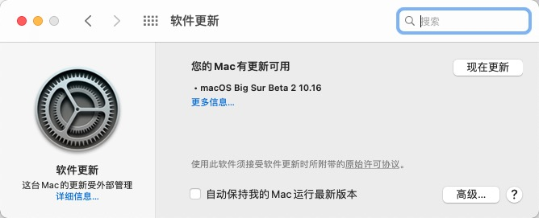
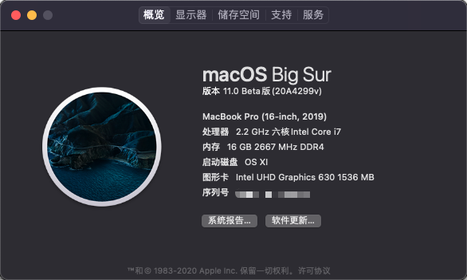
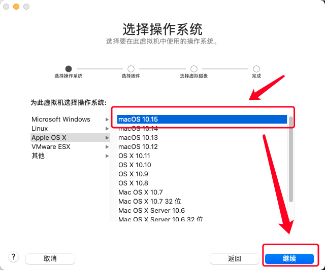

# RazerBlade15-Base-Model-Hackintosh
警告⚠️：本目录仅为个人记录所准备，如果你也想尝试升级macOS11可以以此教程作为参考，本人不会为你操作过程中所出现的任何错误负责！请自己酌量而行。
## 写在最前
- 本文的内容主要参考了[EmeryWan](https://github.com/EmeryWan)的文章[“雷蛇灵刃15黑苹果”](https://github.com/EmeryWan/Razer-Blade-15-2018-Base-Hackintosh)作为入门黑苹果的教程（该文章采用了Clover的引导），[Razer Blade 15 Base Model Hackintosh](https://github.com/blade15basehackintosh)的文章["razerbladehackintosh"](https://github.com/blade15basehackintosh/razerbladehackintosh)作为OC（OpenCore）引导转换的参考文档，以及[doanhmaple](https://github.com/doanhmaple)的文章[“Razer-Blade-15-Advanced-2018-Hackintosh”](https://github.com/doanhmaple/Razer-Blade-15-Advanced-2018-Hackintosh)对ACPI的电池修补工作的patch帮助。这里再次感谢他们对安装黑苹果的分享和付出（Big thanks for [EmeryWan](https://github.com/EmeryWan), [Razer Blade 15 Base Model Hackintosh](https://github.com/blade15basehackintosh) and [doanhmaple](https://github.com/doanhmaple)!!!)。如果你还需要更多关于黑苹果安装以及优化的教程，可以前往[黑果小兵的部落阁](https://blog.daliansky.net/)和[Hackintosh黑苹果长期维护机型EFI及安装教程整理](https://github.com/daliansky/Hackintosh)查看，里面有很多杂七杂八的机型配置和安装教程以及一些实用的黑苹果优化。
- 跟很多人一样，我开始接触黑苹果这个领域是因为macOS的流畅与稳定性，对码农更友好的unix内核和好看的系统UI。再者由于新冠疫情的影响，我被迫长时间拘留在家中实在无聊🥱，并且找到了很多相同机型的教程，这大大减少了入门黑苹果的难度。
- 如果你只想寻求稳定的macOS，建议你前往文章开头的那些文章查看（macOS 10.15），**⚠️这里我只会讲解关于macOS10.16的安装⚠️** ，当然如果你希望充分利用你的显卡（例如gtx1060，1070，960等等20系之前的英伟达显卡），你可以尝试安装macOS 10.13（High Sierra是支持英伟达显卡的最新的版本，在此之后只能运行你的IGPU，也就是英特尔的集成显卡），请自行爬贴查找教程。
- 看到这里如果你真的打算继续安装macOS 11 / 10.16 那么建议你最好更换为博通的网卡进行使用，USB网卡和英特尔网卡驱动在11里仍然存在众多问题，现无法在11里运行。

## 7/7 更新
苹果刚发布了macOS BigSur的beta2版本，同样为全量包，大小将近10GB，使用普通的OTA更新即可。（下载可能略慢，如果进度条不动请耐心等待，这并不是卡了）



猜过的坑：   
- 安装卡引导的请将你的OC更新到7/6以后的OC版本，并把kext里的`VisualSMC`更换为`FakeSMC`
- 安装后无电池图标🔋或者电量一直为0%（触摸板可用但是设置里识别不出来的，**别问我为啥这跟触摸板也有关系，我也不知道，反正我是这样做就好了😯**），请将kext里的`SMCBatteryManager`更换为`ACPIBatteryManager`
- 无需在OC里注入显卡信息，如果显示出现问题可尝试删除`Device`里的显卡注入信息

## 目录
- 硬件介绍
- 最终效果
- 解锁BIOS
- 安装前的准备
- 系统安装
- 一些优化
- 参考
  
## [1]硬件介绍
|        部件      |        型号         |                   最终情况                   |
| :----------: | :-----------------: | :------------------------------------------: |
|     CPU      |      i7-8750H       |                     无问题（系统将采用UHD630作为显卡）                   |
|     GPU      |  Nvdia 1060 Max-Q   | 除 10.13 High Sierra 安装 WebDriver 外，10.13以上版本皆不可用（建议直接屏蔽掉） |
|     硬盘     | 更换为三星EVO 970          |                     无问题（不支持4K）                     |
|     网卡     |       9560NGW （现已更换为DW1560 / BCM94352Z）             |           WIFI 目前还不稳定，蓝牙无问题（建议更换博通网卡，1560的win驱动还没找到，后续会补）            |
|    显示器    |        1080P & 60Hz        |                无问题（可以在60Hz和48Hz之间切换）                     |
|    摄像头    |                     |                     无问题                     |
|    扬声器    |       ALC298              |                     无问题                     |
|    耳机    |                                     |                     无问题                     |
|    麦克风    |                                 |                     无问题                     |
|    触控板    |                            |             无问题                             |
|  HDMI 接口   |                     |    直通显卡，除安装 High Sierra 外不可用     |
| Mini DP 接口 |                     |    直通显卡，除安装 High Sierra 外不可用     |
|    雷电3     |                     |   被识别成 USB3.1 ？？？  |
|    电池      |       |无问题（还能有问题 ？？？）    |

## [2]最终效果


## [3]解锁BIOS
 解锁BIOS可以参考EmeryWan的[教程](https://github.com/EmeryWan/Razer-Blade-15-2018-Base-Hackintosh#3-%E8%A7%A3%E9%94%81bios), 这里就不多描述了。macOS BigSur 对BIOS的大致设定与Catalina一致，有条件的可以尝试解锁CFG和V-TD。（后面有时间的时候我会尝试一步步教你怎么解锁。

 ## [4]安装前的准备
 ### [4-1]BIOS设置

- `Advanced`
  - `Thunderbolt(TM) Configuration`
    - `Security Level` 设置成 `No Security`

- `Chipset`
  - `System Agent (SA) Configuration`
    - `Graphics Configuration`
      - `DVMT Pre-Allocated`  设置成 `64`
      - `DVMT Total Gfx Mem`  设置成 `MAX`

- `Security`
  -  `Secure Boot` 设置成 `Disabled`

- `Boot`
  - `Fast Boot` 设置成 `Disabled`

  - `CSM Configuration`
    - `CSM Support` 设置成 `Disabled`

### [4-2]软件下载
- macOS下
  - 下载好的macOS Big Sur 安装app
  - 一个可以正常工作的 macOS
  - [VMWare Fusion](https://www.vmware.com/products/fusion.html) （虚拟机软件,普通版或pro版都可以）
  - [Paragon VMDK Mounter](http://dl.paragon-software.com/free/VMDK_MOUNTER_2014.dmg) （挂载虚拟机的软件）
  - OpenCore 0.6.0 自编译 （可以直接去下载 Williambj1 每天更新编译好的OC[（点击前往Opencore-Factory）](https://github.com/williambj1/OpenCore-Factory/releases), 也可以自行编译官方的源码[（点击前往OpenCorePkg）](https://github.com/acidanthera/OpenCorePkg)。
- Windows下
  - 一个可以正常工作的 Windows （我相信在坐的各位都有吧🤔）
  - 一个可以编辑代码的软件
    - Sublime Text，Visual Studio Code 等等
  - VMWare WorkStation Pro （注意这里必须是pro版本⚠️）
  - Unlocker 302

## [5]系统安装
### 以下步骤均在macOS上执行
首先在 macOS 中先分一个新的 APFS 容器。**⚠️注意，这里指的一个独立的新容器，建议分60G 以上，越大越好**。这个新的容器就是你要安装系统的磁盘，分完请记住该容量的大小，后面会用到。


打开VMWare Fusion  
用 VMWare Fusion 新建一个自定义虚拟机


系统随便选一个苹果系统就行，我这里选的`10.15`。



点击`继续`


点击`自定设置`


点击`继续`，**这里请记住虚拟机存放的位置，后面会用到。**


点击`处理器与内存`


拖动小标到8G大小，这里调整内存的主要原因是怕安装的时候卡住。。。


设置完左上角点击关闭即可。

接着用 Paragon VMDK Mounter 打开新建的虚拟机，挂载刚创建的分区。**（我相信你们安装VMDk的时候都会卡在激活页面，这里给你们提供了一些有用的帮助：VMDK-MOUNTER-2014-434979472，51537-43450-1B2D9-8213A，怎么填就不用我说了吧，傻子都会😊）**


点击`Attach Selected`。这里由于我是在macOS 11 上截的图，因此出现了“⚠️”，10.15不会出现这个问题


打开`磁盘工具`，将挂载上的 VMDK （显示为外置磁盘）格式化成 HFS（macOS扩展（日志式）），名字就叫 `Big Sur Installer`。   
完成格式化后关闭磁盘工具，用如下命令将 Big Sur 安装程序写入 VMDK磁盘。   
```
sudo /Applications/Install\ macOS\ Beta.app/Contents/Resources/createinstallmedia --volume /Volumes/Big\ Sur\ Installer 
```

进入磁盘工具卸载VMDK分区，然后打开虚拟机，如果能进安装界面，直接点关机。   

打开 OC 的 `config.plist`，使用`OCC`，`Xcode`或者`PaperTree`都行，在`NVRAM`里的 `7C436110-AB2A-4BBB-A880-FE41995C9F82` 下 `Add` 添加 `booter-fileset-basesystem` 和 `booter-fileset-kernel`，类型为 `Data`，值为 `<00>` (OCC里填`00`即可)，`Block` 加不加无所谓，毕竟我们不需要刷新这个变量。  

这里我以`OCC`为例，其他工具同理。


将你制作好的安装盘虚拟机e拷贝到nas或者exfat格式的磁盘中作为中介，至此在macOS上的操作就结束了🔚。

### 以下步骤均在Window下执行
首先把刚才创建的虚拟机转进 Windows，在上面👆操作的最后一步里你用什么存的就从那里转移出来（我咋这么多废话😯）

解锁下载好的 VMWare Workstation Pro （作为一个🇨🇳人，你还不会这种最基础的东西？百度一堆好吧👌）

导入刚才转移过来的虚拟机（双击vmx文件就行。。。）

用 Sublime Text，Visual Studio Code 或其他杂七杂八能用的工具打开虚拟机的 vmx 文件，该改的该，该加的加，下面的是我自己随便生成的，不要拿来登陆
```
board-id.reflectHost = "TRUE" 
board-id = "Mac-937A206F2EE63C01"
hw.model.reflectHost = "FALSE"
hw.model = "MacBookPro15,1"
serialNumber.reflectHost = "FALSE"
serialNumber = "D25XVQYDKGYG"
smbios.reflectHost = "FALSE"
```
备注：第一行的参数应该文件里已经包含了，可以不用再添加一遍。参数顺序无所谓，放哪里都行。

后续内容还在施工中👷，请耐心等待⌛️   
作者不会鸽的放心吧，咕咕咕咕～～～