# RazerBlade15-Base-Model-Hackintosh
警告⚠️：本目录仅为个人记录所准备，如果你也想尝试升级macOS11可以以此教程作为参考，本人不会为你操作过程中所出现的任何错误负责！请自己酌量而行。
## 写在最前
- 本文的内容主要参考了[EmeryWan](https://github.com/EmeryWan)的文章[“雷蛇灵刃15黑苹果”](https://github.com/EmeryWan/Razer-Blade-15-2018-Base-Hackintosh)作为入门黑苹果的教程（该文章采用了Clover的引导），[Razer Blade 15 Base Model Hackintosh](https://github.com/blade15basehackintosh)的文章["razerbladehackintosh"](https://github.com/blade15basehackintosh/razerbladehackintosh)作为OC（OpenCore）引导转换的参考文档，以及[doanhmaple](https://github.com/doanhmaple)的文章[“Razer-Blade-15-Advanced-2018-Hackintosh”](https://github.com/doanhmaple/Razer-Blade-15-Advanced-2018-Hackintosh)对ACPI的电池修补工作的patch帮助。这里再次感谢他们对安装黑苹果的分享和付出（Big thanks for [EmeryWan](https://github.com/EmeryWan), [Razer Blade 15 Base Model Hackintosh](https://github.com/blade15basehackintosh) and [doanhmaple](https://github.com/doanhmaple)!!!)。如果你还需要更多关于黑苹果安装以及优化的教程，可以前往[黑果小兵的部落阁](https://blog.daliansky.net/)和[Hackintosh黑苹果长期维护机型EFI及安装教程整理](https://github.com/daliansky/Hackintosh)查看，里面有很多杂七杂八的机型配置和安装教程以及一些实用的黑苹果优化。
- 跟很多人一样，我开始接触黑苹果这个领域是因为macOS的流畅与稳定性，对码农更友好的unix内核和好看的系统UI。再者由于新冠疫情的影响，我被迫长时间拘留在家中实在无聊🥱，并且找到了很多相同机型的教程，这大大减少了入门黑苹果的难度。
- 如果你只想寻求稳定的macOS，建议你前往文章开头的那些文章查看（macOS 10.15），**⚠️这里我只会讲解关于macOS10.16的安装⚠️** ，当然如果你希望充分利用你的显卡（例如gtx1060，1070，960等等20系之前的英伟达显卡），你可以尝试安装macOS 10.13（High Sierra是支持英伟达显卡的最新的版本，在此之后只能运行你的IGPU，也就是英特尔的集成显卡），请自行爬贴查找教程。
- **本文并不会讲解关于OC配置的问题，我相信既然你想升级 macOS Big Sur ，那么你应该具有一定的OC基础知识，再者由于机型的不同大家的OC也都不大一样，这里很难进行细说。如果你真的是新手并且想尝试新系统，那我也不建议你进行操作，首先新系统的bug有很多，它并不是理想的macOS，其次各种驱动和插件对于 macOS Big Sur 都还在测试阶段并不稳定，如果哪里出了问题，一个新手很难去解决。**
- 看到这里如果你真的打算继续安装macOS 11 / 10.16 那么建议你最好更换为博通的网卡进行使用，USB网卡和英特尔网卡驱动在11里仍然存在众多问题，现无法在11里运行。
- **同机型或者相似机型的同学们可以参考我的efi，当然在你使用我的efi的时候记得更改里面的三码（我忘改了😭），以免造成设备冲突！**

## 7/7 更新
苹果刚发布了macOS BigSur的beta2版本，同样为全量包，大小将近10GB，使用普通的OTA更新即可。（下载可能略慢，如果进度条不动请耐心等待，这并不是卡了）


下面为更新完成的样子（感觉就变了个版本号.....）


从macOS Catalina升级后直接为**beta2**版本，因此并不影响后面的操作。

**7/7 之前：**  
**macOS Catalina ➡️ macOS Big Sur beta1 ➡️ macOS Big Sur beta2**   
**7/7 之后：**   
**macOS Catalina ➡️ macOS Big Sur beta2**   

不确定的可以自己查看自己的**版本号**：
- `20A4299v`  ---beta1
- `20A4300b`  ---beta2

踩过的坑：   
- **安装卡引导的请将你的OC更新到7/6以后的OC版本，并把kext里的`VisualSMC`更换为`FakeSMC`**
- 安装后无电池图标🔋或者电量一直为0%（触摸板可用但是设置里识别不出来的，**别问我为啥这跟触摸板也有关系，我也不知道，反正我是这样做就好了😯**），请将kext里的`SMCBatteryManager`更换为`ACPIBatteryManager`
- 无需在OC里注入显卡信息，如果显示出现问题可尝试删除`Device`里的显卡注入信息 **（仅限 UHD630，其他型号无视本信息）**

## 一些问题
我也是刚接触黑苹果不久，到我写这篇文章才一个多月？ 还有很多问题是我无法解决的，当然我后面也会努力爬贴查找解决方案，毕竟macOS11我不就是这么过来的嘛。如果有哪位大佬知道如何解决可以联系我，感激不尽！

- 与10.15的问题一样，睡眠后无法唤醒，开盖就只有黑屏，其他都正常运作
- 无法进入Recovery  （直升无此问题，但这里并不会讲解直升，也许以后会？）
- ~~Wi-Fi老断~~  (更新AirportBrcmFixup)
- ~~直升系统导致Safari无法正常运行（过一会就闪退）~~
- ~~开机画屏~~  （显卡注入问题，UHD630 无需再注入显卡id）
- ~~电池无显示 & 电量始终为 0%~~  （具体解决方案请移步 [[6-3]电池修复](###[6-3]电池不显示) ）
- ~~触摸板可用但是设置偏好里找不到触摸板~~  （具体解决方案请移步 [[6-3]电池修复](###[6-3]电池不显示) ）
- `sip` 无法关闭  （需要进入Recovery方可更改，据说直升无此问题）
- 时间无法更改自定义设置
- 蓝牙不可用 （已通过更换网卡解决）
- USB网卡不可用
- ~~状态栏卡顿~~   (具体解决方案请移步 [[6-4]状态栏卡顿](###[6-4]状态栏的卡顿) ）
  
## 目录
- [硬件介绍](#1硬件介绍)
- [最终效果](#2最终效果)
- [解锁BIOS](#3解锁bios)
- [安装前的准备](#4安装前的准备)
- [系统安装](#5系统安装)
- [一些优化](#6一些优化)
- [附加：U盘直装](#7附加u盘直装)
- [参考](#8参考)
- [变更目录](#9变更目录)
  
## [1]硬件介绍
|        部件      |        型号         |                   最终情况                   |
| :----------: | :-----------------: | :------------------------------------------: |
|     CPU      |      Intel Core i7-8750H processor, 6 Cores / 12 Threads, 2.2GHz / 4.1GHz, 9MB Cache       |                     无问题（系统将采用UHD630作为显卡）                   |
|     IGPU     |        Intel UHD 630       |   无问题   |
|     GPU      |  Nvdia 1060 Max-Q   | 除 10.13 High Sierra 安装 WebDriver 外，10.13以上版本皆不可用（建议直接屏蔽掉） |
|      内存    |   16GB dual-channel DDR4-2667MHz, up to 64GB    |       无问题      |
|     硬盘     | 更换为三星EVO 970          |                     无问题（不支持4K）                     |
|     网卡     |       9560NGW （现已更换为DW1560 / BCM94352Z）             |           WIFI 目前还不稳定，蓝牙无问题（建议更换博通网卡，1560的win驱动还没找到，后续会补）            |
|    显示器    |        15.6" Full HD 60Hz, 1920 x 1080 IPS      |                无问题（可以在60Hz和48Hz之间切换）                     |
|    摄像头    |       HD webcam (1MP / 720P)              |                     无问题                     |
|    扬声器    |       Realtek ALC298              |                     无问题                     |
|    耳机    |           爱插啥就是啥                          |                     无问题                     |
|    麦克风    |                 鬼晓得啥型号                |                     无问题                     |
|    触控板    |            全玻璃                |             无问题                             |
|  HDMI 接口   |                     |    直通显卡，除安装 High Sierra 外不可用     |
| Mini DP 接口 |                     |    直通显卡，除安装 High Sierra 外不可用     |
|    雷电3     |                     |   被识别成 USB3.1 ？？？  |
|    大小      |       17.8mm x 235mm x 355mm  |    这tm还能变？？？ | 
|    重量       |         2.21 Kg        |    还想变的更轻？别做梦了老铁     | 
|    电池      |    80Wh （好像是，我忘了，反正不耐用...)   |无问题（还能有问题 ？？？）    |
|    电源适配器  |       180W          | 没PD快充，当然你可以自己试试诱骗器    | 

## [2]最终效果


## [3]解锁BIOS
 解锁BIOS可以参考EmeryWan的[教程](https://github.com/EmeryWan/Razer-Blade-15-2018-Base-Hackintosh#3-%E8%A7%A3%E9%94%81bios), 这里就不多描述了。macOS BigSur 对BIOS的大致设定与Catalina一致，有条件的可以尝试解锁CFG。（后面有时间的时候我会尝试一步步教你怎么解锁。）    
 **更新：我已上传改好的bios（1.0.2），只可供同机型同版本bios使用！！！！**  
 **此操作具有不可逆的危险，有可能刷坏bios导致无法点亮，请谨慎操作！！！**

## [4]安装前的准备
### [4-1]BIOS设置

- `Advanced`
  - `Thunderbolt(TM) Configuration`
    - `Security Level` 设置成 `No Security`

- `Chipset`
  - `System Agent (SA) Configuration`
    - `Graphics Configuration`
      - `DVMT Pre-Allocated`  设置成 `64`
      - `DVMT Total Gfx Mem`  设置成 `MAX`

- `Security`
  -  `Secure Boot` 设置成 `Disabled`

- `Boot`
  - `Fast Boot` 设置成 `Disabled`

  - `CSM Configuration`
    - `CSM Support` 设置成 `Disabled`

### [4-2]软件下载
- macOS下
  - 下载好的macOS Big Sur 安装app
  - 一个可以正常工作的 macOS
  - [VMWare Fusion](https://www.vmware.com/products/fusion.html) （虚拟机软件,普通版或pro版都可以）
  - [Paragon VMDK Mounter](http://dl.paragon-software.com/free/VMDK_MOUNTER_2014.dmg) （挂载虚拟机的软件）
  - OpenCore 0.6.0 自编译 （可以直接去下载 Williambj1 每天更新编译好的OC[（点击前往Opencore-Factory）](https://github.com/williambj1/OpenCore-Factory/releases), 也可以自行编译官方的源码[（点击前往OpenCorePkg）](https://github.com/acidanthera/OpenCorePkg)。
- Windows下
  - 一个可以正常工作的 Windows （我相信在坐的各位都有吧🤔）
  - 一个可以编辑代码的软件
    - Sublime Text，Visual Studio Code 等等
  - VMWare WorkStation Pro （注意这里必须是pro版本⚠️）
  - Unlocker 302

## [5]系统安装
*安装过程基于远景论坛的大佬Bat.bat的帖子[「教程」简单扯扯用 VMWare 在实体机上装 Big Sur](http://bbs.pcbeta.com/forum.php?mod=viewthread&tid=1862049&highlight=big%2Bsur)，侵权立删*

### 以下步骤均在macOS上执行
首先在 macOS 中先分一个新的 APFS 容器。**⚠️注意，这里指的一个独立的新容器，建议分60G 以上，越大越好**。这个新的容器就是你要安装系统的磁盘，分完请记住该容量的大小，后面会用到


打开VMWare Fusion  
用 VMWare Fusion 新建一个自定义虚拟机

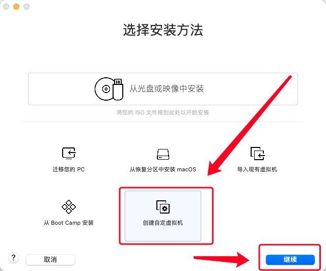

系统随便选一个苹果系统就行，我这里选的`10.15`。


点击`继续`

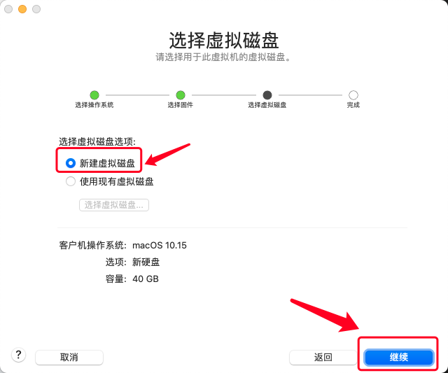

点击`自定设置`

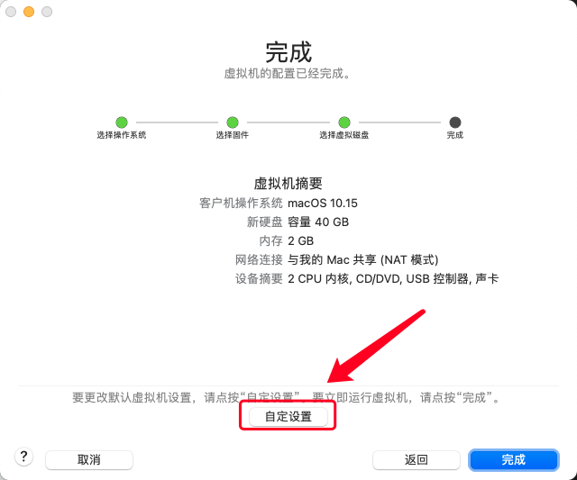

点击`继续`，**这里请记住虚拟机存放的位置，后面会用到。**

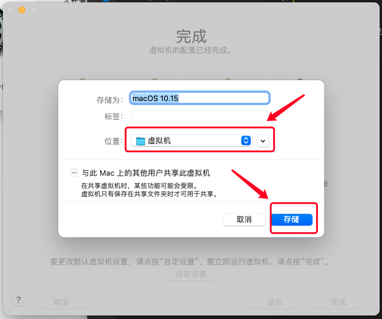

点击`处理器与内存`


拖动小标到8G大小，这里调整内存的主要原因是怕安装的时候卡住。。。

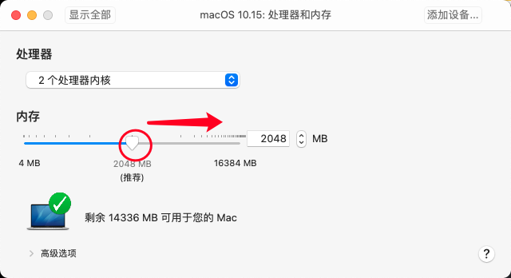

设置完左上角点击关闭即可。

接着用 Paragon VMDK Mounter 打开新建的虚拟机，挂载刚创建的分区。**（我相信你们安装VMDk的时候都会卡在激活页面，这里给你们提供了一些有用的帮助：VMDK-MOUNTER-2014-434979472，51537-43450-1B2D9-8213A，怎么填就不用我说了吧，傻子都会😊）**

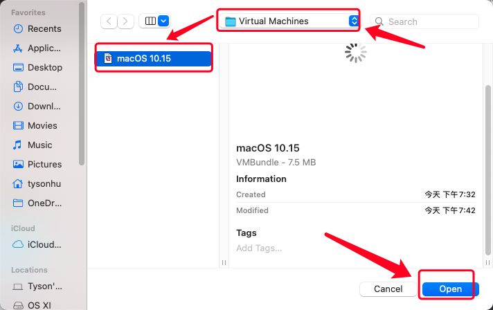

点击`Attach Selected`。这里由于我是在macOS 11 上截的图，因此出现了“⚠️”，10.15不会出现这个问题

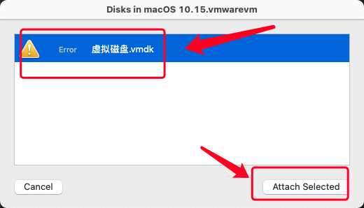

如果你出现了此问题，并显示以下窗口：


请前往`系统偏好设置` ➡️ `安全性与隐私` ➡️ `通用`，解除左下角的锁定然后允许操作即可

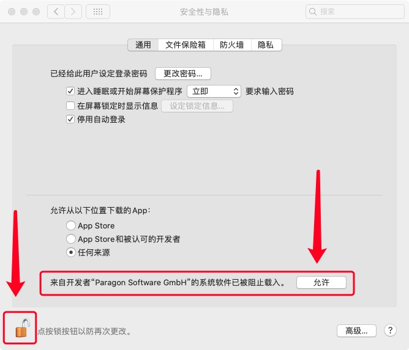

打开`磁盘工具`，将挂载上的 VMDK （显示为外置磁盘）格式化成 HFS（macOS扩展（日志式）），名字就叫 `Big Sur Installer`。

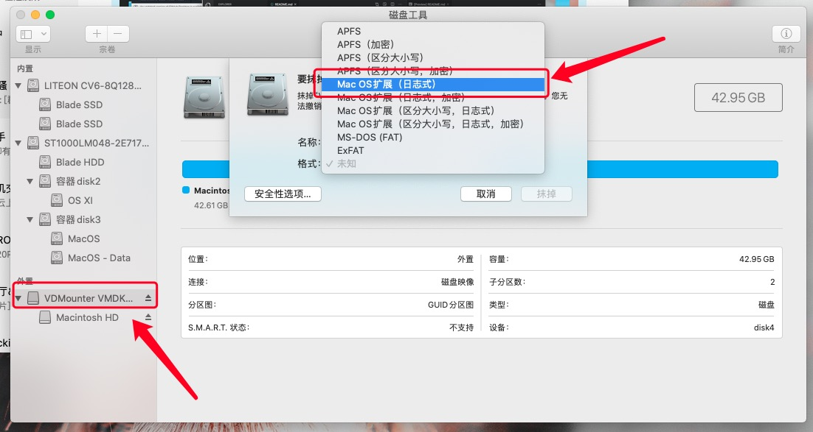

**备注：抹盘应选择红框下方的子磁盘，这里标错了很抱歉**

完成格式化后关闭磁盘工具，用如下命令将 Big Sur 安装程序写入 VMDK磁盘。   
```
sudo /Applications/Install\ macOS\ Beta.app/Contents/Resources/createinstallmedia --volume /Volumes/Big\ Sur\ Installer 
```
备注：这段口令只适用与跟我文件存放相同位置的人，你可以自己拖动安装包和磁盘进入终端（拖进）以对齐文件位置。输入正确后终端询问你是否继续，打 `y` 即可。


进入磁盘工具卸载VMDK分区，然后打开虚拟机，如果能进安装界面，直接点关机。   

打开 OC 的 `config.plist`，使用`OCC`，`Xcode`或者`PaperTree`都行，在`NVRAM`里的 `7C436110-AB2A-4BBB-A880-FE41995C9F82` 下 `Add` 添加 `booter-fileset-basesystem` 和 `booter-fileset-kernel`，类型为 `Data`，值为 `<00>` (OCC里填`00`即可)，`Block` 加不加无所谓，毕竟我们不需要刷新这个变量。  

这里我以`OCC`为例，其他工具同理。


将你制作好的安装盘虚拟机拷贝到nas或者exfat格式的磁盘中作为中介，至此在macOS上的操作就结束了🔚。

### 以下步骤均在Window下执行
首先把刚才创建的虚拟机转进 Windows，在上面👆操作的最后一步里你用什么存的就从那里转移出来（我咋这么多废话😯）

解锁下载好的 VMWare Workstation Pro （作为一个🇨🇳人，你还不会这种最基础的东西？百度一堆好吧👌）

导入刚才转移过来的虚拟机（双击vmx文件就行。。。）

用 Sublime Text，Visual Studio Code 或其他杂七杂八能用的工具打开虚拟机的 vmx 文件，该改的该，该加的加

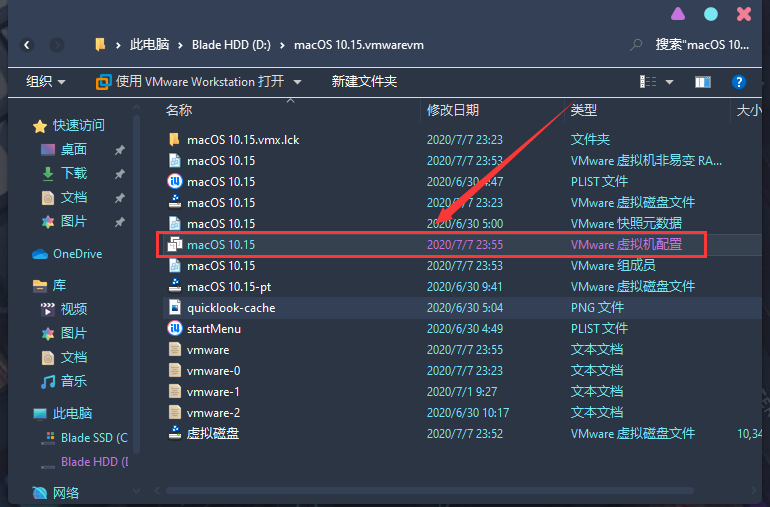

**下面的是我自己随便生成的，不要拿来登陆⚠️**

```
board-id.reflectHost = "TRUE" 
board-id = "Mac-937A206F2EE63C01"
hw.model.reflectHost = "FALSE"
hw.model = "MacBookPro15,1"
serialNumber.reflectHost = "FALSE"
serialNumber = "D25XVQYDKGYG"
smbios.reflectHost = "FALSE"
```
备注：第一行的参数应该文件里已经包含了，可以不用再添加一遍。参数顺序无所谓，放哪里都行。(看图⬇️)

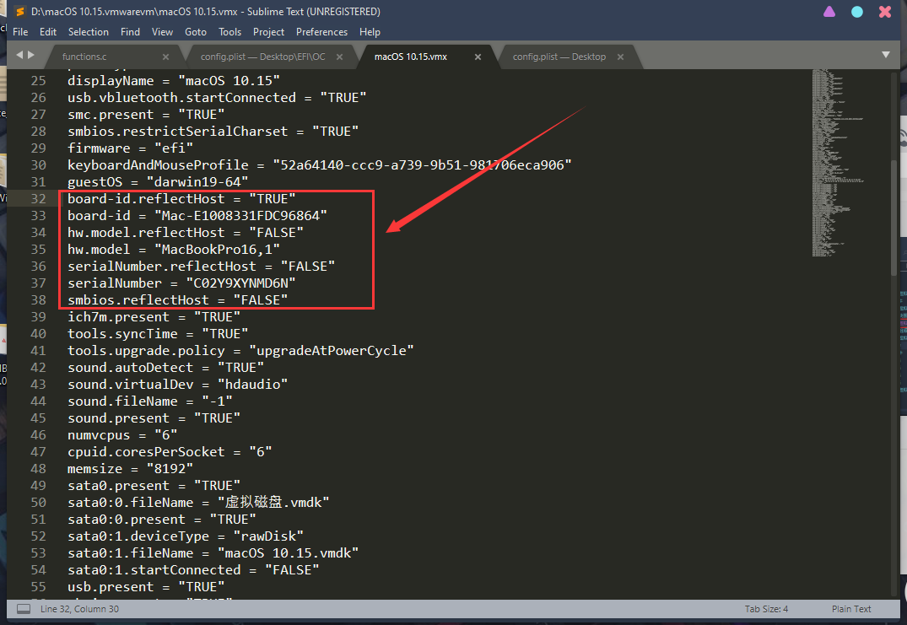

接着运行你下载好的 Unblocker 302，(右键管理员运行 `win-install`，注意必须是以管理员运行⚠️）**如果不运行的话你会发现后面打开虚拟机的时候一直重启（没错，无限重启，贼恶心🤮）**

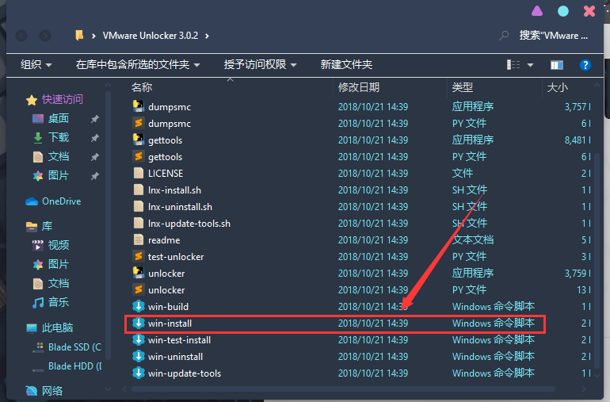

接着进入VMWare Workstation Pro ➡️ 点击 `编辑虚拟机设置`


点击 `添加`

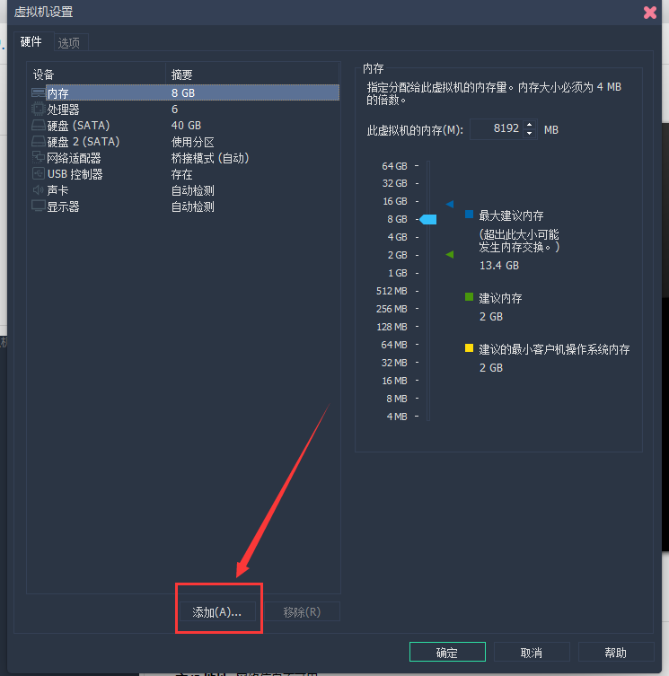

点击 `硬盘` ➡️ 点击 `下一步`

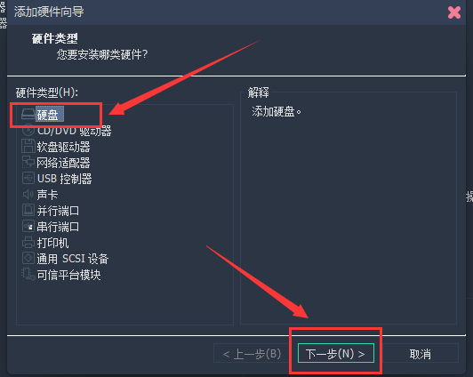

点击 `SATA` ➡️ 点击 `下一步`


点击 `使用物理磁盘` ➡️ 点击 `下一步`

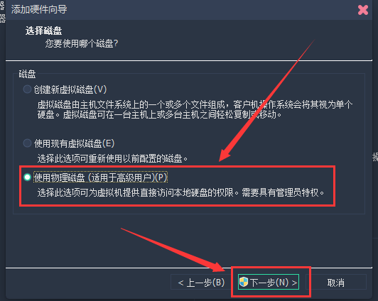

点击 `设备` 角标 选择 你自己要安装的磁盘分区（**开头叫你分的那个APFS容器**）所对应的磁盘，然后选择 `使用单个分区` ➡️ 点击 `下一步` **(忘了是哪个盘？我来帮你想想，找到了！是这一步分的盘！[点我传送](#以下步骤均在macos上执行))**

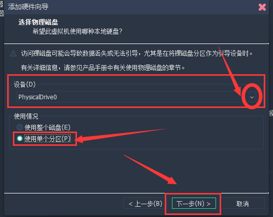

点击在文章开头创建的 APFS 容器 (**请根据分区大小判断⚠️**)  ➡️ 点击 `下一步`


点击 `完成`

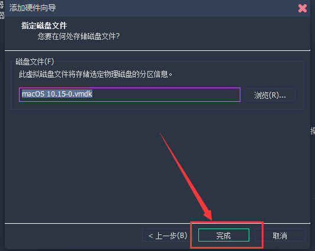

到这应该已经成功添加物理安装磁盘，我们现在可以在设备列表里看到这个刚刚添加的磁盘，确认无误后点击 `确定` 即可

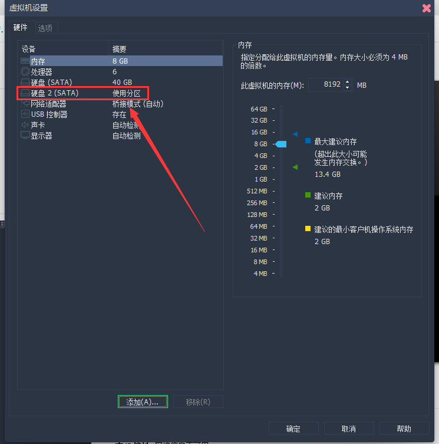

虚拟机开机，直接进安装程序安装，无需再抹盘，然后各种点，装机总会吧.....   装完到选择语言的时候就可以关掉虚拟机了

到此，虚拟机安装就正式结束了。现在你可以重启电脑💻，然后用 OC 开机，继续刚才的激活向导，设置完就可以吃螃蟹了🦀️

**恭喜你，现在已经完成了macOS Big Sur 的系统安装🎉**

## [6]一些优化
### [6-1] 打开TRIM
如果你将系统装在了固态硬盘上，应开启TRIM。这样可以防止系统对硬盘进行多次擦写从而确保硬盘寿命。（什么？你问我机械硬盘要开吗？反正我是开了）

进入终端，填入以下指令：

```
sudo trimforce enable
```
完成后系统会要求你重启

### [6-2]洗白序列号 / 三码
自行进入OCC打开 `config.plist` ,在 `PlatformInfo` 里的 `Generic` 生成三码即可

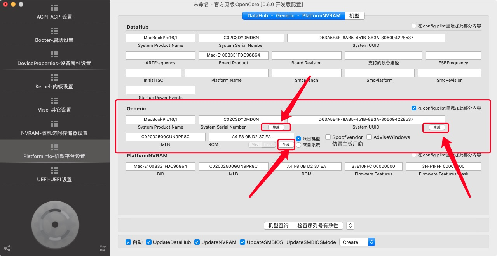

**注意，如果你打算用 OpenCore 引导 Windows，请将 `System UUID` 一栏修改成你BIOS对应的UUID，否则导致Windows的所有软件激活失效！⚠️**

### [6-3]电池不显示
将kext里的 `SMCBatteryManager` 换成 `ACPIBatteryManager` 即可解决问题（前提是你的dsdt是补好的！）

### [6-4]状态栏的卡顿
#### [6-4-1]删除 WiFiAgent 解锁卡顿问题
big sur的卡顿是因为找不到wifi设备造成的！那么使用usb网卡、无网卡的用户就需要删掉 `WiFiAgent` 这个启动项，这里只是移动了下位置。

```
$mount -o rw /

$cd /System/Library/LaunchAgents

$sudo mv com.apple.wifi.WiFiAgent.plist ../LaunchAgentsIgnored
```
运行完毕重启即可

提示：USB网卡现在还无法在macOS Big Sur 上使用！当然说不定以后可以（说的都是什么废话...），这里附上链接🔗供大🔥🚪查看 [点击跳转至Wireless-USB-Big-Sur-Adapter](https://github.com/chris1111/Wireless-USB-Big-Sur-Adapter)


#### [6-4-2]直接更换博通网卡
删除WiFiAgent只是缓兵之计，除了插网线否则你还是连不上网，因此给电脑更换博通网卡才是最好的解决方法。（而且雷蛇拆机并不会影响保修，不像某些厂商....）

整个机身共有 10 颗螺丝分一种规格，你需要一把 T5 的螺丝刀来打开它，卸下所有螺丝即可拆下背板。

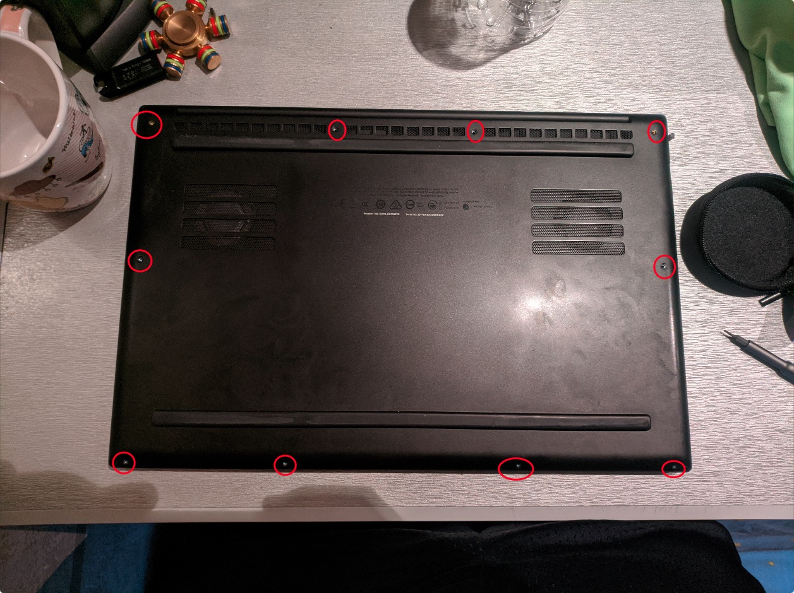

网卡位于机器的右下角，插槽处被一张防静电胶布覆盖，需要揭开它。

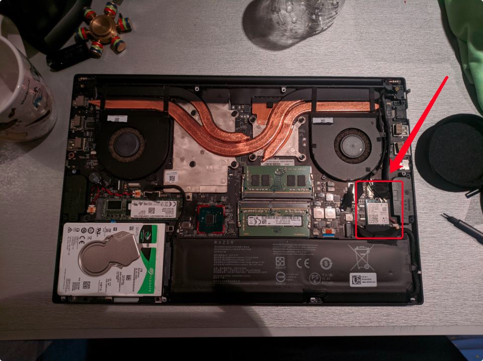

记得断开天线，不会吧，不会吧，不会有人不知道吧。

换好装上背板即可

### [6-5]开启HiDPI
由于macOS11对于安全性更强的要求，macOS Catalina中解锁sle的命令已经失效了。尽管如此，HiDPI的开启不受影响，传统开启的方法是把显示器文件写入进系统目录 /System/Library/Displays/Contents/Resources/Overrides，这样做有风险而且升级后失效。  

把显示器文件写入目录 /Library/Displays/Contents/Resources/Overrides 能取得相同效果，而且这样做的好处有：
- 支持 Big Sur
- 升级系统后不需要重新开启
- 保持系统目录纯净
- 容易恢复，删除/Library/Displays/ 文件夹即可

开启方法：

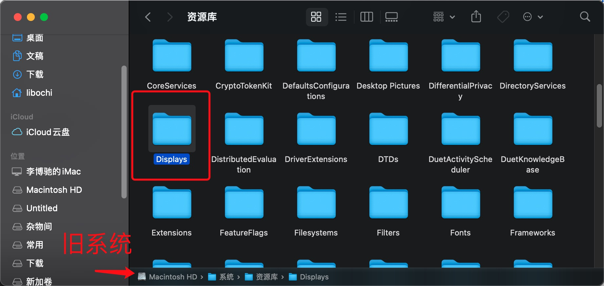

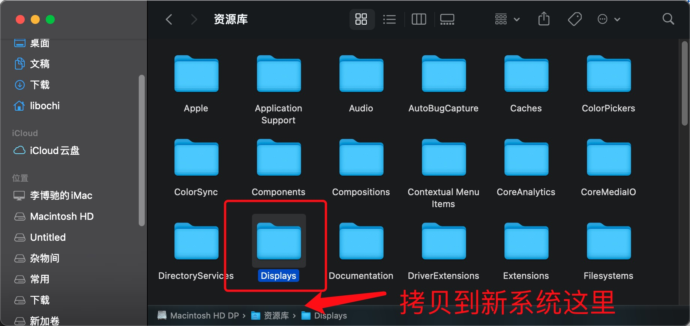

结果展示：

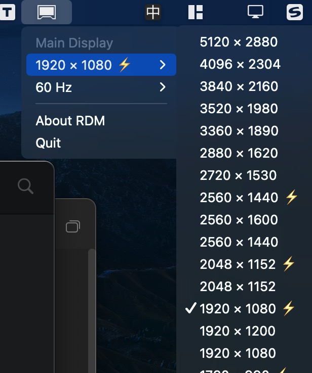

*备注：因为我并没有开启HiDPI因此这些图片都取自hxd的[博客](https://wanan.run/2020/07/01/%E9%BB%91%E8%8B%B9%E6%9E%9C%E5%AE%89%E8%A3%85Big%20Sur%E8%BF%87%E7%A8%8B%E4%B8%AD%E9%81%87%E5%88%B0%E7%9A%84%E9%97%AE%E9%A2%98%E6%80%BB%E7%BB%93/#more)里, 灵感来自远景大佬郑世祺，[来源](http://bbs.pcbeta.com/viewthread-1862148-1-1.html)。* *版权归郑世祺所有，侵权立删©️*

## [7]附加：U盘直装
*搬运自 Bochi‘s Blog [OpenCore U盘全新直装Big Sur](https://wanan.run/2020/07/07/OpenCoreU%E7%9B%98%E5%85%A8%E6%96%B0%E7%9B%B4%E8%A3%85BigSur/)*

### 准备：

- U盘 16GB以上
- 安装文件
- 7/6或更新的 `OC`，`Lilu`，`Whatevergreen`

`Lilu` 和 `Whatevergreen` 我已放入`Tools`里,可以自行下载（同样由Bochi提供，在这里再次感谢🙏）。   
什么？你说U盘也需要提供？你怕是再想peach！！！💢

### Config 修改 （OpenCore 0.6.0）：

- `NVRAM`
  - `7C436110-AB2A-4BBB-A880-FE41995C9F82`
    - 删除 `csr-active-config` 
- `Kernel`
   - `添加 / Add`
     - 添加 `FakeSMC`
     - 禁用 `VirtualSMC`

保存退出

### 将安装文件写入U盘

终端输入指令：
```
sudo /Volumes/Install\ macOS\ Beta/Install\ macOS\ Beta.app/Contents/Resources/createinstallmedia --volume /Volumes/UNTITLED /Volumes/Install\ macOS\ Beta/Install\ macOS\ Beta.app --nointeraction
```
其中，`createinstallmedia`、`Install macOS Beta.app` 这两个文件、还有中间`/Volumes/UNTITLED`的**U盘名字**可以直接**拖拽**到终端。

### 安装

重启以U盘启动即可进入系统安装界面，接着一直点，重启几次便可完成系统安装

### 启动项问题

如果安装成功后在OC中找不到新系统的启动项，就进入已经装好的Mac系统 ➡️ 启动磁盘 ➡️ 选择 10.16 的启动盘然后重新启动即可。


## [8]参考
- https://github.com/EmeryWan/Razer-Blade-15-2018-Base-Hackintosh
- https://github.com/blade15basehackintosh/razerbladehackintosh
- https://github.com/doanhmaple/Razer-Blade-15-Advanced-2018-Hackintosh
- https://github.com/stonevil/Razer_Blade_Advanced_early_2019_Hackintosh
- https://blog.daliansky.net/
- http://bbs.pcbeta.com/viewthread-1862049-1-1.html
- http://bbs.pcbeta.com/viewthread-1862835-1-1.html
- http://bbs.pcbeta.com/viewthread-1862148-1-1.html
- https://wanan.run/2020/07/07/OpenCoreU%E7%9B%98%E5%85%A8%E6%96%B0%E7%9B%B4%E8%A3%85BigSur/
- https://wanan.run/2020/07/01/%E9%BB%91%E8%8B%B9%E6%9E%9C%E5%AE%89%E8%A3%85Big%20Sur%E8%BF%87%E7%A8%8B%E4%B8%AD%E9%81%87%E5%88%B0%E7%9A%84%E9%97%AE%E9%A2%98%E6%80%BB%E7%BB%93/
  
## [9]变更目录
- 7/10
  - 修复Wi-Fi不定时自动断开的毛病
  - 更新release分支，一般会在8 ~ 24小时左右更新驱动
    - **⚠️ 注意：我发布的自编译驱动未经原作者同意，因此有问题请不要在原作者的issue里发表！⚠️**
  - **更新7/10号自编译 `Lilu`  （Lilu 1.4.6）**
    - Silence stupid clang analyzer
  - ~~**更新7/10号自编译 WhateverGreen  （WhateverGreen 1.4.1）**~~
    - Revert workaround for ATIController::start on 11.0
- 7/9
  - **更新7/9号自编译 `OpenCore` （OC 0.6.0）** (已添加进Tools里)
    - DxeIpl: Fix ACPI reset register detection
  - **更新7/8号自编译 `Lilu`  （Lilu 1.4.6）**
    - Added device publishing API to monitor device startup
  - **更新7/9号自编译 `WhateverGreen`  （WhateverGreen 1.4.1）**
    - Add first generation Intel HD Graphics support
  - **更新7/8号自编译 `AppleALC`  （AppleALC 1.5.1）**
    - Use new device publishing API for 11.0 syncing 
  - **更新7/5号自编译 `AirportBrcmFixup`  （AirportBrcmFixup 2.0.8）**
    - Fix warning 'Value stored to 'subSystemDeviceID' during its initializ…
- 7/7
  - **更新 macOS Big Sur beta2**
  - **更换 `VisualSMC` 为 `FakeSMC`**
- 7/5
  - 更换 `Broadcom BCM94352Z` / `DW1560` 网卡 
    - 蓝牙得到解决
    - Wi-Fi得到解决
    - 状态栏卡顿得到解决
  - **修复状态栏卡顿**
- 7/4
  - **修复开机画屏**
  - **修复电池显示**
  - **修复触摸板**
- 6/30
  - **更新 macOS Big Sur beta1**  
  - **更新 OC 0.6.0**  
  
后续内容还在施工中👷，请耐心等待⌛️   
作者不会鸽的放心吧，咕咕咕咕～～～